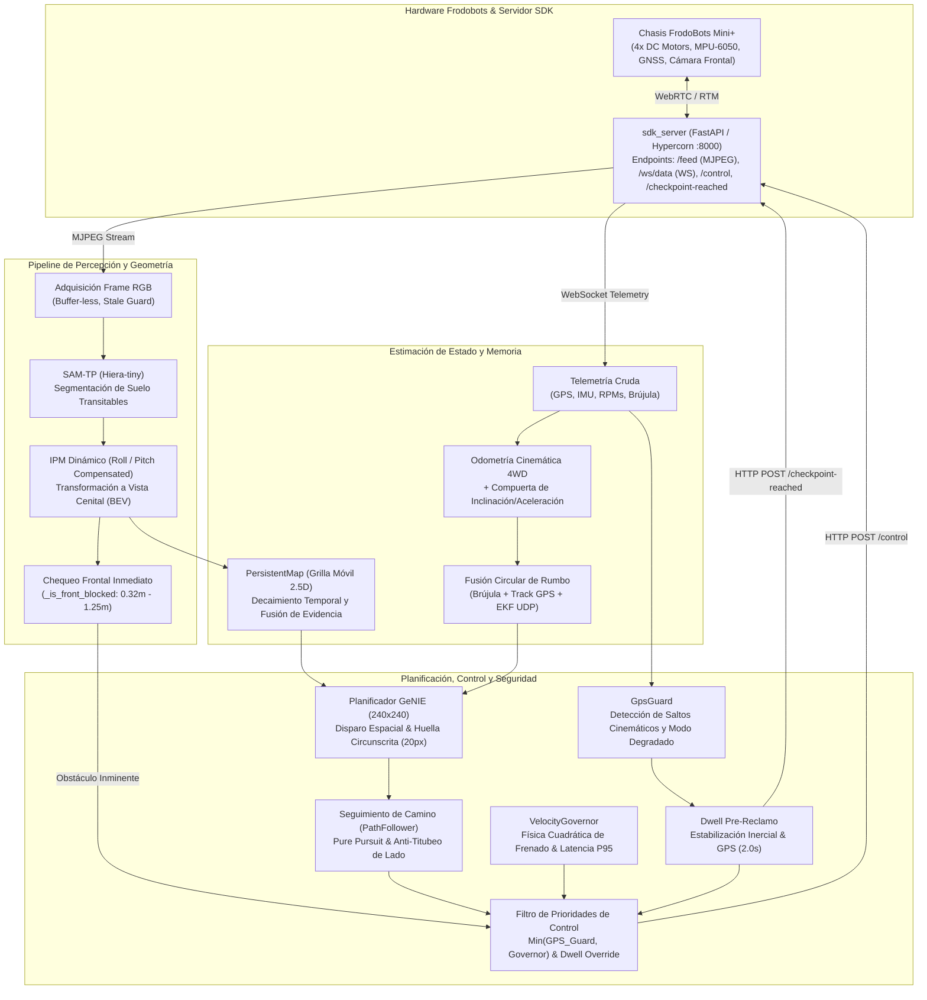
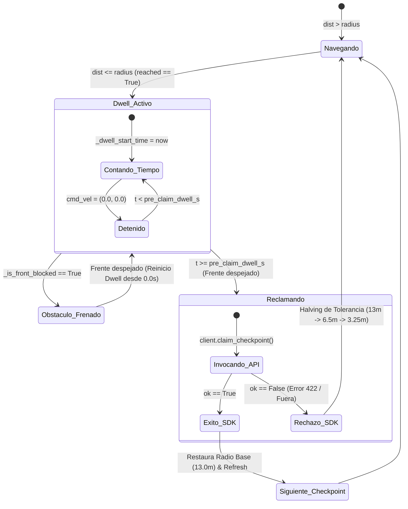

# Arquitectura del Sistema — La Rovernetta (GeNIE / SAM-TP)

Este documento describe en profundidad la arquitectura del software de navegación autónoma off-road de **La Rovernetta**: diseño modular, modelos físicos y matemáticos, transformaciones geométricas, manejo de concurrencia y mecanismos de seguridad de hardware. Complementa al [README.md](README.md) detallando el funcionamiento interno del stack.

La Rovernetta combina segmentación visual profunda con modelos de base (**SAM-TP / Hiera-tiny**), proyección perspectival inversa dinámica con compensación de cabeceo y alabeo (**Dynamic IPM**), memoria espacial persistente local (**PersistentMap**), planificación de trayectorias en vista cenital (**GeNIE Polynomial Path Bank**), y un sistema multinivel de control de velocidad y seguridad geodésica.

---

## 1. Diagrama de Arquitectura Global



---

## 2. Estructura de Módulos del Paquete `genie_rover`

| Módulo | Responsabilidad Funcional | Componentes Clave |
| :--- | :--- | :--- |
| **[`bridge.py`](genie/genie_rover/bridge.py)** | Orquestador central del ciclo de ejecución, disparo espacial y máquina de estados. | Clase `Bridge`, `LoopStats` |
| **[`perception.py`](genie/genie_rover/perception.py)** | Inferencia visual profunda con SAM-TP y proyección geométrica a Bird's-Eye-View. | Clase `Perception`, `PerspectiveProjector` |
| **[`persistent_map.py`](genie/genie_rover/persistent_map.py)** | Grilla de ocupación probabilística 2.5D con decaimiento temporal y ventana móvil. | Clase `PersistentMap`, `MapConfig` |
| **[`odometry.py`](genie/genie_rover/odometry.py)** | Estimación cinemática 4WD, compuerta de aceleración para tilt y canal UDP para EKF. | Clase `Odometry`, `Pose` |
| **[`navigation.py`](genie/genie_rover/navigation.py)** | Transformaciones geodésicas (Haversine / ENU local), seguidor de camino y control de giro. | `check_checkpoint_reached`, `PathFollower`, `LocalGoal` |
| **[`gps_guard.py`](genie/genie_rover/gps_guard.py)** | Guarda multinivel contra saltos de GPS, multipath y deriva de estimación de rumbo. | Clase `GpsGuard`, `GpsGuardStatus` |
| **[`velocity_governor.py`](genie/genie_rover/velocity_governor.py)** | Modulación cuadrática de velocidad admisible basada en física de frenado y latencia P95. | Clase `VelocityGovernor`, `GovernorConfig` |
| **[`vlm_recovery.py`](genie/genie_rover/vlm_recovery.py)** | Mecanismo de recuperación asistido por modelos de lenguaje y visión (VLM) ante atascos. | Clase `VlmRecovery` |
| **[`sdk_client.py`](genie/genie_rover/sdk_client.py)** | Cliente HTTP/WebSocket de bajo nivel para comunicación con el servidor SDK del robot. | Clase `RoverClient`, `Checkpoint` |

---

## 3. Filosofía de Arquitectura y Desacoplamiento

A diferencia de las arquitecturas tradicionales basadas en nodos distribuidos de ROS 2 comunicados por DDS (como la implementada en el Dream Team), La Rovernetta utiliza un **ciclo asíncrono híbrido de alto rendimiento**:

1. **Bucle de Percepción a Frecuencia de Fotograma (5–8 Hz):**  
   Cada imagen capturada por la cámara se procesa de inmediato con SAM-TP e IPM dinámico para:
   - Alimentar el chequeo de colisión frontal ultra-rápido (`_is_front_blocked`), garantizando tiempos de reacción mínimos ante obstáculos súbitos.
   - Integrar la evidencia espacial en el `PersistentMap`.
2. **Disparo Espacial de Planificación (*Spatial Triggering*):**  
   Llamar al planificador de caminos en cada frame genera titubeo (*path chattering*) y sobrecarga computacional inútil. GeNIE solo se invoca cuando:
   - El robot avanzó más de `replan_every_m` ($0.1\text{ m}$) respecto al punto del último plan.
   - El camino cacheado remanente es menor a `replan_min_remaining_m` ($0.4\text{ m}$).
   - Transcurrió la red de seguridad temporal `replan_max_s` ($2.0\text{ s}$).
   Entre disparos espaciales, el rover sigue la trayectoria previamente comprometida reproyectada dinámicamente al marco del robot en cada ciclo (`path_to_robot`).

---

## 4. Subsistemas Clave en Detalle

### 4.1. Gobernador Dinámico de Velocidad por Latencia (`velocity_governor.py`)

> **Nivel de Madurez:** Implementado y Verificado en Nivel 1.  
> **Fundamento Físico:** Dinámica de frenado cuadrática y tiempo de respuesta en lazo cerrado.

Cuando un rover opera vía control remoto o teleoperación autónoma celular, la latencia total de procesamiento y comunicación $\Delta t$ puede fluctuar ampliamente. Si el rover viaja a una velocidad $v$, la distancia total necesaria para detenerse ante un obstáculo no visible es:

$$d_{\text{stop}}(v) = d_{\text{reacción}} + d_{\text{frenado}} = v \cdot \left( t_{\text{plan\_p95}} + t_{\text{cmd\_latency}} \right) + \frac{v^2}{2 \cdot a_{\text{brake}}}$$

Para garantizar que el vehículo pueda frenar de forma segura dentro del horizonte observable $d_{\text{horizon}}$ con un margen de seguridad multiplicativo $M$, se impone la restricción:

$$d_{\text{stop}}(v) \cdot M \le d_{\text{horizon}} \implies \frac{M}{2 \cdot a_{\text{brake}}} \cdot v^2 + M \cdot t_{\text{react}} \cdot v - d_{\text{horizon}} \le 0$$

Resolviendo analíticamente la ecuación cuadrática para la raíz positiva, se obtiene la cota superior estricta de velocidad segura:

$$v_{\text{safe}} = \frac{-M \cdot t_{\text{react}} + \sqrt{(M \cdot t_{\text{react}})^2 + 4 \cdot \left(\frac{M}{2 \cdot a_{\text{brake}}}\right) \cdot d_{\text{horizon}}}}{2 \cdot \left(\frac{M}{2 \cdot a_{\text{brake}}}\right)}$$

donde:
- $t_{\text{react}} = t_{\text{plan\_p95}} + t_{\text{cmd\_latency}}$.
- $t_{\text{plan\_p95}}$: Percentil 95 de la duración real del ciclo de control, calculado sobre una ventana deslizante de 30 muestras.
- $t_{\text{cmd\_latency}} = 2.0\text{ s}$: Retardo asumido entre emisión del comando y respuesta mecánica del chasis.
- $a_{\text{brake}} = 1.5\text{ m/s}^2$: Desaceleración efectiva de frenado del chasis con orugas/ruedas.
- $M = 1.2$: Margen de seguridad ($+20\%$).
- $d_{\text{horizon}} = 1.25\text{ m}$: Alcance longitudinal del chequeo frontal confiable.

#### Filtrado Asimétrico y Modo Stop & Wait
- **Frenado Inmediato ($\alpha_{\text{down}} = 1.0$):** Ante picos de latencia o degradación súbita del ciclo, el límite de velocidad cae instantáneamente en ese mismo frame.
- **Recuperación Gradual ($\alpha_{\text{up}} = 0.25$):** Al normalizarse la latencia, la velocidad se incrementa progresivamente mediante filtro exponencial para evitar aceleraciones bruscas.
- **Corte Stop & Wait ($v_{\text{safe}} < 0.10\text{ m/s}$):** Si la latencia es tan extrema que la velocidad física calculada cae por debajo de $0.10\text{ m/s}$ (equivalente a un throttle $\sim 0.18$, incapaz de vencer la fricción estática del terreno), el gobernador corta el avance a `0.0` (Stop & Wait) para evitar recalentamiento y órdenes a ciegas.

---

### 4.2. Corrección de Huella Circunscrita (`footprint_px: 20`)

> **Nivel de Madurez:** Implementado y Verificado en Nivel 1.  
> **Fundamento Geométrico:** Mapeo analítico sobre la grilla de decisión GeNIE.

El chasis FrodoBots Mini+ presenta dimensiones físicas de largo $L = 0.250\text{ m}$ y ancho $W = 0.190\text{ m}$, resultando en un diámetro circunscrito:

$$D_{\text{circ}} = \sqrt{L^2 + W^2} = \sqrt{0.250^2 + 0.190^2} = 0.314\text{ m} \quad (R_{\text{circ}} = 0.157\text{ m})$$

En el planificador GeNIE ([`planner.py`](genie/genie_path_planner/planner.py)), la función `evaluate_path_costs` evalúa la colisión de cada punto del camino extrayendo un parche cuadrado de radio en píxeles $r\_half = \text{footprint\_px} // 2$ sobre la grilla `planner_cost` ($240 \times 240\text{ px}$).

#### Caracterización de la Grilla y Resolución No Isotrópica
Con el mapa persistente activo:
- **Eje X (Lateral):** Cobertura total de $2 \times \text{side\_range\_m} = 4.0\text{ m}$.  
  $$\Delta X = \frac{4.0\text{ m}}{240\text{ px}} = 0.01667\text{ m/px} = 1.667\text{ cm/px}$$
- **Eje Y (Longitudinal / Avance):** Cobertura total de $\text{plan\_forward\_m} = 3.0\text{ m}$.  
  $$\Delta Y = \frac{3.0\text{ m}}{240\text{ px}} = 0.01250\text{ m/px} = 1.250\text{ cm/px}$$

#### Comparación de Footprint: 12 px vs 20 px

| Métrica | Valor Previo (`footprint_px: 12`) | Valor Corregido (`footprint_px: 20`) |
| :--- | :--- | :--- |
| **Radio en píxeles ($r\_half$)** | $6\text{ px}$ | $10\text{ px}$ |
| **Tamaño de ventana ($2 \cdot r\_half + 1$)** | $13 \times 13\text{ px}$ | $21 \times 21\text{ px}$ |
| **Ancho cubierto en X (Lateral)** | $13 \times 1.667\text{ cm} = \mathbf{21.67\text{ cm}}$ | $21 \times 1.667\text{ cm} = \mathbf{35.00\text{ cm}}$ |
| **Margen vs $D_{\text{circ}} = 31.4\text{ cm}$** | **$-31.0\%$ (FALSO NEGATIVO)** | **$+11.5\%$ (CONSERVADOR)** |
| **Largo cubierto en Y (Avance)** | $13 \times 1.250\text{ cm} = \mathbf{16.25\text{ cm}}$ | $21 \times 1.250\text{ cm} = \mathbf{26.25\text{ cm}}$ |
| **Margen vs Longitud $L = 25.0\text{ cm}$** | **$-35.0\%$ (INSUFICIENTE)** | **$+5.0\%$ (CUBRE CHASIS)** |
| **Solapamiento longitudinal a 100 pts** | $79\%$ | **$87\%$** ($\approx 3\text{ cm}$ entre muestras) |

El valor de 12 px provocaba colisiones laterales de las ruedas delanteras en giros cerrados contra esquinas y rocas. La configuración corregida a **20 px** garantiza que cualquier obstáculo dentro del círculo circunscrito active el costo de colisión ($\text{cost} \ge 0.5$) y descarte el camino.

---

### 4.3. Parada Pre-Reclamo y Estrangulamiento Geodésico de Checkpoints

> **Nivel de Madurez:** Implementado y Verificado en Nivel 1.  
> **Fundamento Operativo:** Disipación inercial del chasis y absorción de jitter GNSS.

Cuando el rover alcanza la proximidad de un waypoint geodésico (`dist_to_cp <= radius`), emitir un reclamo inmediato mientras el vehículo conserva velocidad lineal provoca:
1. Sobrepaso (*overshoot*) fuera del perímetro admisible si el SDK rechaza la petición.
2. Lecturas GNSS inestables inducidas por vibraciones mecánicas y cabeceo durante la marcha.

Para solucionar este problema, se implementó la **Parada de Estabilización Pre-Reclamo**:



#### Propiedades Críticas del Mecanismo
- **Prioridad Absoluta de Seguridad:** Durante el tiempo de dwell (`pre_claim_dwell_s: 2.0s`), el pipeline de percepción continúa ejecutándose en cada frame. Si un obstáculo invade el frente, el dwell se **aborta de inmediato**, se envía comando de frenado por colisión y `_dwell_start_time` se restablece a `None`.
- **Reinicio Transparente (Sin Orfandad):** Cuando el obstáculo se retira y el frente vuelve a estar despejado, si el rover sigue dentro del radio de checkpoint, se detecta automáticamente y se inicia un nuevo período de estabilización de 2.0 segundos completos.
- **Preservación de Checkpoint Halving:** Si el servidor del SDK rechaza el reclamo (por ejemplo, porque la geocerca interna del servidor es más estricta que los 13.0 m nominales), el radio de arribo se reduce a la mitad:
  $$r_{\text{current}} = \max(0.5\text{ m}, r_{\text{current}} \cdot 0.5)$$
  Esto fuerza al rover a reanudar la navegación cinemática y aproximarse a $\le 6.5\text{ m}$ antes de volver a intentar el dwell y el reclamo, evitando saturar la API en bucle infinito.

---

### 4.4. Jerarquía de Prioridades en el Comando Final (`_send_path_command`)

La modulación de velocidad lineal sobre el comando motriz final sigue una jerarquía estricta y documentada en [`bridge.py`](genie/genie_rover/bridge.py#L778):

```
+-------------------------------------------------------------------------------+
|  1. PRIORIDAD 1: Parada Absoluta (Bypass total de planificación)              |
|     - Dwell pre-reclamo activo (cmd = 0.0, 0.0)                               |
|     - Obstáculo frontal inminente (_is_front_blocked == True)                 |
|     - Falla crítica GPS Nivel 3 (Emergency Stop)                              |
+-------------------------------------------------------------------------------+
                                      │ (Si ninguna parada de P1 está activa)
                                      ▼
+-------------------------------------------------------------------------------+
|  2. PRIORIDAD 2: Guarda de GPS Degradado (Nivel 2)                            |
|     - Acota rango lineal admisible a [min_linear, max_linear] (ej. <= 0.25)    |
|     - Evita desvíos violentos por pérdida de anclaje de rumbo o multipath     |
+-------------------------------------------------------------------------------+
                                      │
                                      ▼
+-------------------------------------------------------------------------------+
|  3. PRIORIDAD 3: Gobernador Dinámico por Latencia P95                         |
|     - Clamp descendente: cmd.linear = min(cmd.linear, v_safe_throttle)        |
|     - Corte Stop & Wait (linear = 0.0) si v_safe < 0.10 m/s                   |
+-------------------------------------------------------------------------------+
                                      │
                                      ▼
+-------------------------------------------------------------------------------+
|  COMANDO FINAL ENVIADO:                                                       |
|  Rige la intersección más restrictiva: min(GPS_Guard, Governor).             |
|  Ningún componente downstream puede acelerar por encima del techo upstream.  |
+-------------------------------------------------------------------------------+
```

---

## 5. Matriz de Parámetros del Sistema y Clasificación Epistemológica

Todos los parámetros numéricos de configuración en [`genie/configs/frodobot_rover.yaml`](genie/configs/frodobot_rover.yaml) están categorizados bajo tres tipos de rigor:
- **MEDIDO:** Obtenido empíricamente mediante pruebas de campo en el hardware físico y registrado en logs de telemetría.
- **DERIVADO:** Obtenido matemáticamente a partir de dimensiones físicas, especificaciones de hoja de datos o resoluciones de grilla.
- **ASUMIDO:** Estimación conservadora de ingeniería que prioriza la seguridad operativa.

| Parámetro | Valor | Clasificación | Justificación y Fuente |
| :--- | :--- | :--- | :--- |
| `footprint_px` | `20` | **DERIVADO** | Grilla $240 \times 240$ ($\Delta X = 1.667\text{ cm/px}$). Ventana de $21\text{ px} = 35.0\text{ cm} \ge D_{\text{circ}} = 31.4\text{ cm}$. |
| `governor_a_brake` | `1.5 m/s²` | **ASUMIDO** | Desaceleración en frenado de emergencia sobre terreno irregular sin patinamiento excesivo. |
| `governor_cmd_latency_s` | `2.0 s` | **ASUMIDO** | Punto medio del rango 1.5–2.5s medido en el giro motorizado de 360°, adoptado como cota fija de seguridad. |
| `governor_margin` | `1.2` | **ASUMIDO** | Margen multiplicativo del $+20\%$ sobre la distancia de frenado cuadrática. |
| `governor_min_speed_mps`| `0.10 m/s` | **ASUMIDO** | Umbral físico inferior de avance; por debajo la fricción estática detiene las ruedas. |
| `governor_max_linear_mps`| `0.557 m/s`| **DERIVADO** | Velocidad a throttle 1.0 calculada desde 112 RPM nominales y radio de rueda de $0.0475\text{ m}$. |
| `governor_alpha_up` | `0.25` | **ASUMIDO** | Factor de suavizado exponencial para aceleración anti-oscilación post-recuperación de latencia. |
| `pre_claim_dwell_s` | `2.0 s` | **ASUMIDO** | Tiempo necesario para asentar la suspensión y estabilizar la dispersión del promedio GNSS antes del reclamo. |
| `checkpoint_reached_radius_m` | `13.0 m` | **DERIVADO** | Perímetro ERC de 15.0m menos margen de seguridad de 2.0m para absorber el jitter de constelación GNSS. |
| `replan_every_m` | `0.1 m` | **MEDIDO** | Disparo espacial optimizado para corregir trayectoria en pendientes sin saturar CPU. |
| `replan_min_remaining_m`| `0.4 m` | **DERIVADO** | Longitud crítica de camino remanente antes de agotar la trayectoria local. |
| `replan_max_s` | `2.0 s` | **ASUMIDO** | Red de seguridad temporal ante detenciones cinemáticas de la odometría. |

---

## 6. Verificación y Suite de Pruebas Automatizadas

El sistema cuenta con una cobertura de pruebas unitarias y de integración que se ejecutan sobre un entorno Python 3.10 con `pytest`:

```bash
# Ejecución de la suite completa de pruebas de La Rovernetta
pytest genie/ -v
```

### Resumen de Suites Unitarias

| Archivo de Prueba | Tests | Cobertura / Comportamiento Verificado |
| :--- | :---: | :--- |
| [`test_velocity_governor.py`](genie/genie_rover/test_velocity_governor.py) | 8 | Inversión cuadrática de $v_{\text{safe}}$, filtro asimétrico $\alpha$, Stop & Wait, composición con GPS Guard. |
| [`test_footprint_corner.py`](genie/genie_rover/test_footprint_corner.py) | 1 | Detección analítica de colisión en esquina ($13\text{ cm}$ lateral, $10\text{ cm}$ frontal) con `footprint_px: 20` vs 12. |
| [`test_pre_claim_dwell.py`](genie/genie_rover/test_pre_claim_dwell.py) | 7 | Dwell de 2.0s, retención de parada, aborto por obstáculo, reinicio limpio tras despeje y halving post-rechazo. |
| [`test_checkpoint_reached.py`](genie/genie_rover/test_checkpoint_reached.py) | 6 | Frontera geodésica exacta ($12.9\text{ m}$ vs $13.1\text{ m}$), estrangulamiento $13.0 \to 6.5 \to 3.25\text{ m}$. |
| [`test_gps_guard.py`](genie/genie_rover/test_gps_guard.py) | 7 | Niveles 1, 2 y 3 de guarda contra saltos cinemáticos y pérdida de señal GPS. |
| [`test_bilateral_recovery.py`](genie/genie_rover/test_bilateral_recovery.py) | 6 | Recuperación informada por mapa persistente, retroceso y evaluación de transitabilidad. |
| [`test_camera_tilt.py`](genie/genie_rover/test_camera_tilt.py) | 7 | Compensación IPM por pitch y roll dinámico medidos por la IMU. |
| [`test_recovery_scan_360.py`](genie/genie_rover/test_recovery_scan_360.py) | 8 | Escaneo circular con salida temprana por sector libre ($\ge 70\%$). |
| [`test_recovery_tilt_veto.py`](genie/genie_rover/test_recovery_tilt_veto.py) | 13 | Veto de giro en pendientes ($\ge 8^\circ$) para prevención de vuelcos. |
| [`test_recovery_turn_latency.py`](genie/genie_rover/test_recovery_turn_latency.py) | 3 | Compensación de inercia y latencia angular en giros nominales. |
| [`test_localization_robustness.py`](genie/genie_rover/test_localization_robustness.py) | 6 | Robustez de estimación de rumbo ante pérdidas temporales de brújula y saltos GNSS. |
| **Total Suite** | **72** | **72 tests pasando (0 fallas, 0 regresiones)** |

---

## 7. Hoja de Ruta (Comparativa con Dream Team y Próximos Niveles)

| Capacidad / Feature | Dream Team (ROS 2) | La Rovernetta (GeNIE) | Estado y Próximos Pasos |
| :--- | :---: | :---: | :--- |
| **Gobernador por Latencia P95** | Sí (`er_planning`) | **Sí (`velocity_governor.py`)** | **Completado (Nivel 1)** |
| **Huella Circunscrita Corregida** | Sí (`20 px` en 240x240) | **Sí (`20 px` en 240x240)** | **Completado (Nivel 1)** |
| **Parada Pre-Reclamo de Checkpoint**| Sí (2.0s dwell) | **Sí (2.0s dwell + guarda)** | **Completado (Nivel 1)** |
| **Estrangulamiento de Checkpoints** | Sí ($13 \to 6.5 \to 3.25\text{m}$) | **Sí ($13 \to 6.5 \to 3.25\text{m}$)** | **Completado (Nivel 1)** |
| **IPM con Compensación Dinámica Tilt**| No | **Sí (`Perception` IPM)** | **Exclusivo La Rovernetta** |
| **Memoria Espacial Persistente** | Bayesiana global (400m) | Local móvil (8m, 2.5D) | Nivel 3 (Evaluar persistencia extendida) |
| **Planificador Global (D\* Lite)** | Sí (`global_planner_node`) | No (GeNIE Local + GPS Goal) | Nivel 3 (Evaluar si el terreno requiere grafos) |
| **Calibración Óptica Intrínseca/Extrínseca**| Pendiente (ChArUco) | Pendiente (ChArUco) | Tarea de hardware en terreno |
