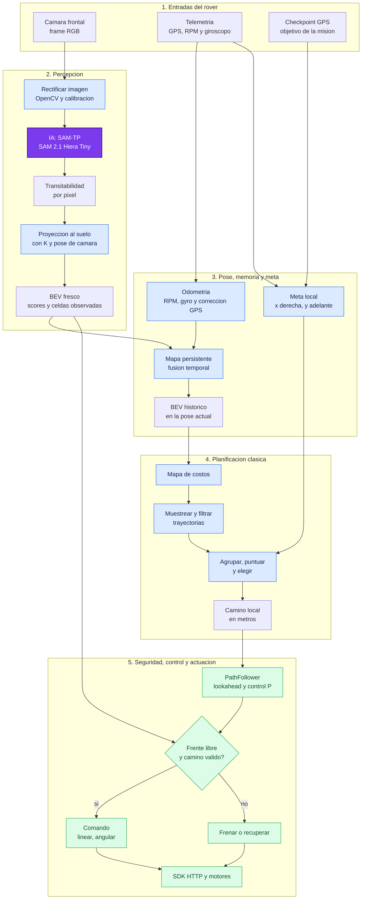
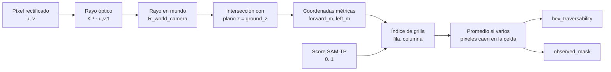
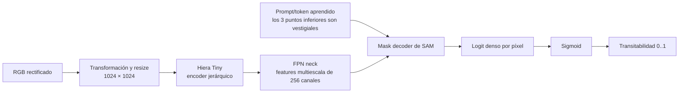
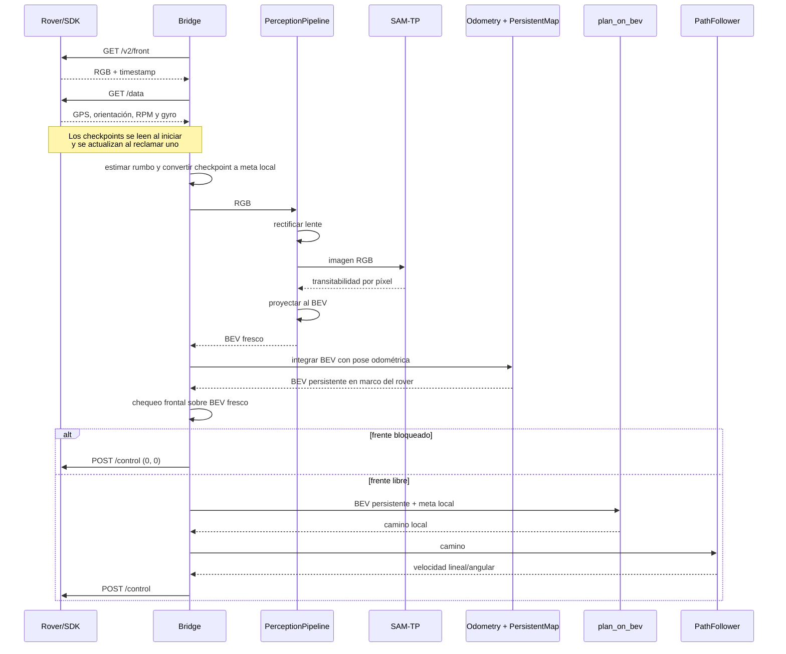

# Arquitectura de planificación y actuación

Este documento representa el flujo **online real** implementado por
`genie/genie_rover/bridge.py`, desde las entradas del Earth Rover hasta los
comandos enviados a los motores. Se distingue entre aprendizaje automático,
geometría/algoritmos clásicos y control.

**Actualización: backend MPPI opcional implementado.** Los diagramas siguientes
describen la configuración predeterminada (`polynomial` + `legacy`). Ahora el
bridge también permite elegir `navigation.trajectory_algorithm: mppi` y,
de manera independiente, `safety.recovery_algorithm: mppi`. MPPI consulta el
BEV fresco y el mapa persistente, simula controles diferenciales y ejecuta un
pulso de control validado; no usa K-means ni PathFollower. El recovery MPPI
mantiene subobjetivos e intentos acotados y comprueba los retrocesos contra el
mapa. Ver [configuración, módulos, unidades y pruebas de MPPI](../genie/README_MPPI.md).

También está disponible `navigation.trajectory_algorithm: nomad`: genera
propuestas desde frames RGB recientes y reutiliza el filtrado de huella/costos
del planner, con ranking adicional por distancia al GPS. Mantiene PathFollower
y el recovery seleccionado. No carga dependencias ni pesos cuando no se usa.
Ver [instalación opcional y configuración de NoMaD](../genie/README_NOMAD.md).

## Diagrama principal



Leyenda: violeta = IA activa; azul = cálculo clásico; verde = seguridad o
control. Gemini no aparece en este flujo porque todavía no está integrado al
lazo online; se documenta por separado en la sección de modelos.

## BEV explicado desde cero

**BEV** significa *Bird's-Eye View*: una grilla vista desde arriba y alineada
con el rover. No es una segunda imagen tomada desde arriba ni la salida directa
de SAM-TP. Es una representación métrica construida por geometría a partir de
la predicción de la cámara.

```text
                 lejos / adelante (y_forward > 0)
                 fila 0
        izquierda                         derecha
       x_right < 0                       x_right > 0
              +-----------------------+
              |  ?  .  .  X  X  .  ? |
              |  ?  .  .  X  .  .  ? |   . transitable, valor cercano a 1
              |  ?  .  .  .  .  .  ? |   X no transitable, cercano a 0
              |  ?  ?  .  R  .  ?  ? |   ? no observado, valor -1
              +-----------------------+
                       rover
                 última fila, centro
```

En `frodobot_rover.yaml`, el BEV fresco cubre aproximadamente **2 m hacia
adelante y 4 m de ancho** (`side_range_m = 2` a cada lado), con una resolución
de **0,03 m por celda**. Por eso su tamaño nominal es aproximadamente
`67 × 134`: filas longitudinales por columnas laterales. El mapa persistente
amplía el contexto, pero después vuelve a entregar al planner una ventana BEV
orientada con la pose actual del rover.

### Cómo pasa un píxel de cámara a una celda BEV



El cálculo usa los intrínsecos de cámara `K = (fx, fy, cx, cy)` y
`T_world_camera`, la pose calibrada de la cámara. Para cada píxel `(u,v)`:

1. Se construye el rayo óptico
   `[(u-cx)/fx, (v-cy)/fy, 1]`.
2. Se rota el rayo al marco mundo con la rotación de `T_world_camera`.
3. Se calcula dónde corta el plano del suelo `z = ground_z`.
4. Se descartan intersecciones detrás de la cámara, a más de
   `max_ray_distance_m`, fuera del alcance frontal o fuera del ancho lateral.
5. Las coordenadas métricas se discretizan a fila y columna. Cuando varios
   píxeles llegan a la misma celda, se promedian sus scores de transitabilidad.

El resultado son **dos matrices inseparables**:

- `traversability: float32[H,W]`: `1` significa muy transitable, `0` poco o
  nada transitable y `-1` significa desconocido.
- `observed: uint8[H,W]`: indica qué celdas recibieron evidencia. Evita
  confundir “SAM-TP cree que no se puede pasar” con “la cámara nunca lo vio”.

### Supuesto y limitación más importante del BEV

La proyección RGB supone que el score de cada píxel pertenece al **plano del
suelo**. Funciona para etiquetar el piso, pero un objeto vertical no tiene una
profundidad real conocida: su píxel se prolonga hasta cortar el suelo y puede
quedar “dibujado” en una posición aproximada. La calibración, la rectificación
de distorsión y el límite de distancia reducen el error, pero no lo eliminan.
El pipeline offline admite profundidad RGB-D y alturas de obstáculos; el
`PerceptionPipeline` online del rover mostrado aquí usa solamente RGB.

### BEV fresco frente a mapa persistente

Son productos distintos y se usan con objetivos distintos:

| Producto | Marco | Conserva historia | Consumidor |
|---|---|---:|---|
| BEV fresco | Rover/cámara actual | No | `front_is_blocked`, para frenar ante algo recién aparecido |
| `PersistentMap.value + conf` | Mundo local | Sí | Acumula observaciones usando odometría |
| BEV extraído del mapa | Rover actual | Sí | `plan_on_bev`, para planear sin olvidar lo que salió de cámara |

Al integrar, cada celda fresca se transforma de rover a mundo mediante
`Pose(x,y,theta)`. Su valor se combina como
`nuevo = (1-α)·anterior + α·observación`, con `α=0,45` en el YAML. La confianza
aumenta con nueva evidencia y tanto valor como confianza decaen con el tiempo;
el valor tiende a `0,5`. Luego `extract_bev()` vuelve a muestrear una ventana
en el marco del rover. Las celdas con confianza menor que `0,15` salen como
desconocidas (`-1`).

## Contratos entre módulos

Esta tabla muestra exactamente qué entrega una caja a la siguiente. Es el hilo
más útil para seguir el código sin perderse entre archivos.

| De → hacia | Dato | Forma/unidad | Qué significa |
|---|---|---|---|
| SDK → `Bridge` | `rgb`, `frame_ts` | `uint8[H,W,3]`, RGB; Unix s | Imagen frontal y marca para detectar video congelado |
| SDK → `Bridge` | `Telemetry.raw` | JSON | GPS, orientación, RPM, gyro, velocidad, batería y señal |
| Checkpoint + telemetría → `goal_from_gps` | lat/lon actuales y objetivo + rumbo | grados | Objetivo global de la misión |
| `goal_from_gps` → planner | `LocalGoal` | metros: `[x_right, y_forward]` | Meta local limitada a `goal_range_m`; indica dirección, no toda la ruta global |
| RGB → `Undistorter` | frame | `uint8[H,W,3]` | Rectifica el gran angular y ajusta `K` si cambió la resolución |
| RGB rectificado → `SamTpRunner` | imagen | RGB; internamente 1024² | Entrada de la única red neuronal online |
| SAM-TP → proyección | `trav_img` | `float32[H,W]`, `[0,1]` | Probabilidad/score denso de transitabilidad por píxel |
| Proyección → `Bridge` | `BevResult` | BEV `[Hbev,Wbev]` + máscara | Evidencia métrica fresca alrededor del frente del rover |
| Telemetría → `Odometry` | RPM + gyro + GPS | RPM, grados/s, lat/lon | Pose local `x,y,theta`; gyro domina la rotación y GPS corrige deriva traslacional |
| BEV fresco + pose → `PersistentMap` | scores observados | grilla local + pose métrica | Inserta la observación en una grilla anclada al mundo |
| `PersistentMap` → planner | `plan_bev`, `plan_obs` | `[Hbev,Wbev]` | Ventana histórica reorientada al rover actual |
| Planner → `PathFollower` | `final_path_xy_m` | `float32[N,2]`, metros | Secuencia ordenada `[x_right,y_forward]` desde el rover |
| `PathFollower` → SDK | `DriveCommand` | `linear, angular ∈ [-1,1]` | Comando normalizado, no velocidad en m/s o rad/s |

Si `memory.enabled` fuera `false`, el BEV fresco pasa directamente al planner
y `Odometry/PersistentMap` quedan fuera del camino de datos.

## Qué modelos de IA usa

| Modelo | Estado en el flujo online | Entrada | Salida | Para qué se usa |
|---|---|---|---|---|
| **SAM-TP**, adaptación de **SAM 2.1** con backbone **Hiera Tiny** | Activo, es el núcleo de percepción | Un frame RGB rectificado, reescalado internamente a 1024 × 1024 | Logit/máscara densa transformada a transitabilidad `[0,1]` | Distinguir por píxel el terreno transitable del que no lo es. No decide velocidades ni genera directamente el camino. |
| **Gemini 3.5 Flash Lite** (VLM remoto; reemplazable con `GENAI_MODEL`) | Código disponible, **no conectado actualmente a `Bridge._recover()`** | Imagen frontal JPEG + prompt | JSON: `on_road`, dirección, confianza y razón | Elegir izquierda/derecha/adelante/atrás cuando no se encuentra un camino. Actualmente la recuperación real es un giro fijo a ciegas. |
| K-means adaptativo | Activo si `planner.use_clustering: true`, pero es ML clásico no entrenado | Trayectorias geométricas válidas | Grupos de trayectorias | Agrupar alternativas similares y seleccionar el grupo cuya orientación se acerca a la meta GPS. No es una red neuronal. |

La configuración de producción selecciona el checkpoint genérico
`checkpoint_2.pt` de SAM-TP. Hay comentada una alternativa fine-tuneada,
`checkpoints/checkpoint_finetuned_v2.pt`, pero **no es la seleccionada** en
`configs/frodobot_rover.yaml`. La carpeta `ML_model/` prepara datasets y el
flujo de fine-tuning; no forma parte del lazo de inferencia ni actuación.

### 1. SAM-TP: qué hay dentro y qué aprende

SAM-TP reutiliza la arquitectura de segmentación de SAM 2.1, adaptada para
predecir transitabilidad. Su configuración activa contiene:



- **Hiera Tiny** es el encoder visual: extrae rasgos de textura, bordes,
  objetos y contexto a distintas escalas. El YAML usa `embed_dim: 96` y etapas
  `[1,2,7,2]`.
- El **FPN neck** combina niveles del encoder y los expresa con 256 canales.
- El **decoder de máscaras** produce un logit por píxel.
- Esta variante usa `want_custom_prompt_encoder: 2`: el código aclara que el
  encoder custom ignora los prompts espaciales y usa un token aprendido. Los
  tres puntos marcados en el borde inferior se conservan por compatibilidad
  con la API del predictor, no son la regla que define el suelo.
- `memory_attention`, `memory_encoder` y `num_maskmem` están desactivados. La
  “memoria” online no es memoria neuronal de SAM2: es `PersistentMap`, una
  grilla clásica externa.

El checkpoint contiene los pesos aprendidos que convierten rasgos visuales en
transitabilidad. El modelo **no conoce** el GPS, la pose, el checkpoint de la
misión, la forma de las trayectorias ni las velocidades del motor.

Hay dos envoltorios de inferencia:

- Online: `genie_rover.perception.SamTpRunner`, que crea el predictor una sola
  vez, elige CPU/GPU y precisión, rectifica antes de inferir y aplica sigmoid.
- Offline: `sam2.sam_tp.SAM_TP`, usado por el planificador de imágenes y
  herramientas. Crea un predictor por llamada y entrega logits + heatmap.

### 2. Gemini para recuperación: módulo lateral, no controlador

`vlm_recovery.PY` comprime el frame a JPEG (lado máximo 768 px), lo envía junto
con un prompt y valida una respuesta JSON estructurada:

```text
{ on_road: bool, heading: izquierda|derecha|adelante|atras,
  confianza: 0..1, razon: string }
```

El modelo por defecto codificado es `gemini-3.5-flash-lite`, configurable con
`GENAI_MODEL`. Un timeout, credenciales ausentes, error o confianza menor que
el umbral devuelve `None`. El diseño previsto es que el bridge use entonces el
barrido clásico. Sin embargo, **el bridge actual nunca llama esta función**, de
modo que Gemini no participa en decisiones ni comandos reales.

### 3. K-means: aprendizaje automático clásico sin entrenamiento

Cuando `use_clustering: true`, las trayectorias supervivientes se agrupan con
K-means adaptativo, se fusionan centroides con orientación parecida y se elige
el grupo más alineado con la meta. No usa checkpoint, red neuronal ni datos de
entrenamiento; opera únicamente sobre las curvas de la iteración actual.

## El planificador, módulo por módulo

```mermaid
flowchart TD
    IN[BEV: transitabilidad + observed] --> C1[known = finito, >= 0 y observado]
    IN --> C2[costo conocido = 1 - transitabilidad]
    C1 --> C3[desconocido = unknown_cost 0.2]
    C2 --> C4[suavizado Gaussiano]
    C3 --> C4
    C4 --> RES[Resize a grilla 240 × 240]

    START[Inicio: última fila, centro] --> SAMPLE
    EDGES[30 metas en bordes superior/laterales] --> SAMPLE[20 puntos medios por meta<br/>curvas cuadráticas]
    SAMPLE --> BANK[Hasta ~600 candidatos<br/>101 muestras uniformes por arco]
    BANK --> VALID[Sólo dentro de grilla y<br/>siempre avanzando]
    VALID --> FILTER[Rechazo si demasiados puntos<br/>superan costo 0.35 bajo huella]
    RES --> FILTER
    FILTER --> KM[K-means adaptativo opcional]
    GOAL[Meta GPS convertida a píxel] --> KM
    KM --> PCOST[Costo acumulado exp(alpha·costo)<br/>sobre huella de 12 px]
    RES --> PCOST
    PCOST --> TOP[Mejores 12]
    TOP --> FUSE[Promedio ponderado y validación;<br/>fallback al mejor individual]
    FUSE --> OUT[Camino en píxeles]
    OUT --> XY[Conversión a metros<br/>x_right, y_forward]
```

Detalles que suelen inducir a error:

- La meta GPS orienta la **selección del grupo**, pero con
  `include_goal_in_path_bank: false` no se inserta como extremo obligatorio de
  cada curva. El banco explora salidas por los bordes de la grilla.
- `footprint_px` evalúa un área alrededor de cada punto, no sólo una línea; así
  aproxima el ancho físico del rover.
- El costo desconocido actual es `0,2`: lo nunca visto no queda prohibido, pero
  recibe un costo explícito.
- El camino final puede ser una combinación de las mejores trayectorias. Si la
  combinación resulta peor que ellas, se usa el mejor candidato individual.
- Con los valores actuales se intentan `30 × 20 = 600` curvas antes de los
  descartes geométricos y de costo.

## Del camino a los motores

`PathFollower` es un controlador reactivo sencillo:

1. Ordena el camino si fuera necesario y acumula su longitud de arco.
2. Busca el punto situado a `lookahead_m = 1,5 m`; si el camino termina antes,
   usa el último punto.
3. Calcula `error_deg = atan2(x_right, y_forward)`.
4. Si `|error| > 90°`, ordena velocidad lineal cero y giro fijo en el lugar.
5. En otro caso avanza, reduciendo hasta 50 % la velocidad según el error, y
   calcula el giro proporcional `angular = angular_sign · kp · error_rad`.
6. Satura el resultado con `max_linear = 0,7` y `max_angular = 0,45`.
7. La histéresis de `Bridge._apply_commit()` evita cambiar repetidamente el
   lado de esquive por pequeñas variaciones entre planes.
8. `RoverClient.control()` vuelve a limitar ambos números a `[-1,1]` y los
   envía mediante `POST /control`.

No hay aquí PID completo, MPC, aprendizaje por refuerzo ni una red que prediga
acciones. Tampoco aparece en este repositorio el lazo eléctrico interno que
convierte esos valores normalizados en corriente/RPM: esa parte queda detrás
del firmware y el SDK del rover.

## Secuencia de una iteración online



## Responsabilidades y archivos

| Etapa | Archivo principal | Naturaleza |
|---|---|---|
| Acceso a cámara, telemetría, checkpoints y actuadores | `genie/genie_rover/sdk_client.py` | I/O HTTP |
| Orquestación y políticas de seguridad | `genie/genie_rover/bridge.py` | Lógica clásica |
| Inferencia SAM-TP y creación del BEV | `genie/genie_rover/perception.py` | IA + geometría |
| Arquitectura/configuración de SAM-TP | `genie/sam2/configs/sam2.1_inference_tiny/sam2.1_custom2.yaml` | Red neuronal |
| Proyección imagen/BEV | `genie/genie_path_planner/projection.py` | Geometría clásica |
| Memoria temporal del terreno | `genie/genie_rover/persistent_map.py` | Fusión probabilística/heurística |
| Pose local | `genie/genie_rover/odometry.py` | Cinemática + fusión gyro/GPS |
| Muestreo, filtrado y selección de caminos | `genie/genie_path_planner/planner.py` y módulos auxiliares | Planificación clásica |
| Conversión de camino a comando | `genie/genie_rover/navigation.py` | Control proporcional con lookahead |
| Recuperación visual opcional | `genie/genie_rover/vlm_recovery.PY` y `programs/client/genai_client.py` | VLM remoto, no integrado |
| Preparación de datos/fine-tuning | `ML_model/` | Pipeline de entrenamiento offline |

## Observaciones sobre el estado actual

- `SAM-TP` es la única red neuronal que participa efectivamente en cada vuelta
  del lazo de navegación online.
- El planificador no es una política neuronal end-to-end: construye un mapa de
  costos, muestrea curvas, descarta las inseguras y elige/fusiona las mejores.
- La actuación tampoco usa IA: `PathFollower` toma un punto de anticipación,
  gira en el lugar ante errores grandes y aplica una ganancia proporcional al
  error angular mientras avanza.
- `safety.use_vlm_recovery` y sus umbrales figuran en YAML, pero el bridge no
  los lee. El VLM todavía no altera la actuación.
- La configuración describe una caché de camino y replanning por distancia,
  pero el `bridge.py` actual llama a `plan_on_bev()` en cada iteración que llega
  al planificador. Es documentación/configuración adelantada respecto del código.
- El chequeo de colisión usa deliberadamente el BEV del frame más reciente, no
  el mapa promediado, de modo que un obstáculo nuevo pueda provocar un freno
  inmediato.
