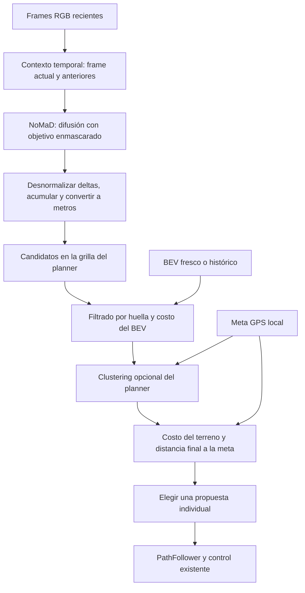

# NoMaD como generador opcional de trayectorias

El bridge admite tres generadores, seleccionados de manera excluyente:

```yaml
navigation:
  trajectory_algorithm: nomad   # polynomial | mppi | nomad
safety:
  recovery_algorithm: legacy    # legacy | mppi, independiente del generador
```

El valor predeterminado sigue siendo `polynomial`. Si NoMaD no está seleccionado,
no se lee su configuración, no se importan sus paquetes y no se cargan pesos.
Los requisitos opcionales están separados de `requirements.txt`.
NoMaD genera candidatos; el GPS y el mapa se usan fuera de la red para elegir.
Esta implementación no cambia el algoritmo de recovery ni requiere imágenes
objetivo/topomaps. Puede combinarse con cualquiera de los recoveries existentes.

## Flujo implementado



- Entrada de red: imágenes RGB del SDK, redimensionadas y normalizadas con
  el protocolo del despliegue oficial. El encoder recibe `context_size + 1`
  imágenes (cuatro con el YAML oficial), no un BEV como si fuera una fotografía.
- Se ejecutan los pasos DDPM definidos por el YAML del modelo; no se cambia el
  número de pasos del checkpoint silenciosamente para acelerar la inferencia.
- Se desnormalizan los incrementos usando `action_min/max`, se acumulan los
  waypoints y se aplica `waypoint_scale_m`. Ejes originales: adelante/izquierda;
  ejes del planner: derecha/adelante. Se añade el origen del rover.
- Se descartan propuestas no finitas, estacionarias, con reversa o fuera de la
  ventana BEV. No se recortan ni se sustituyen silenciosamente por polinómicas.
  La reversa queda para el recovery; el PathFollower actual es de avance.
- Se remuestrean por longitud de arco y se convierten a coordenadas de la
  grilla. Se respetan por separado ancho y alcance frontal del mapa histórico.
- Se reutiliza `plan_on_bev(candidate_path_bank=...)`: mismo mapa de costos,
  huella, umbrales y clustering opcional. Para NoMaD se comprueba todo el camino,
  no solamente los primeros puntos.
- El ranking añade `goal_weight * número_de_puntos * distancia_final_en_metros`
  al costo acumulado de terreno. No se prohíbe alejarse inicialmente de la meta.
- Se conserva el candidato individual con menor costo: no se promedian modos
  que pasan por lados distintos de un obstáculo. `planner.best_k` no se usa para
  fusionar propuestas NoMaD.

Si todos los candidatos se descartan, el resultado es un plan vacío y el bridge
usa su política de freno/recovery configurada. La ausencia de contexto durante
el arranque no cuenta como fallo del planner.

## Instalación opcional en el entorno de GeNIE

No se descargan repositorios, paquetes ni pesos automáticamente al ejecutar el
bridge. En tu entorno `sam_tp`, desde `genie/`:

```bash
mkdir -p third_party checkpoints
git clone https://github.com/robodhruv/visualnav-transformer.git third_party/visualnav-transformer
git clone https://github.com/real-stanford/diffusion_policy.git third_party/diffusion_policy
python -m pip install -r requirements-nomad.txt
python -m pip install --no-deps -e third_party/visualnav-transformer/train
python -m pip install --no-deps -e third_party/diffusion_policy
```

Se presupone PyTorch y torchvision compatibles ya instalados para SAM-TP. Se
evitan los scripts de despliegue ROS y las dependencias de entrenamiento como
wandb; se importan únicamente las clases del modelo necesarias para inferencia.
Los repositorios externos pueden cambiar: si instalás otras revisiones, verificar
compatibilidad con las firmas del adaptador y el checkpoint.

Descargar **nomad.pth** del enlace de checkpoints del
[repositorio oficial](https://github.com/robodhruv/visualnav-transformer#loading-the-model-weights)
y colocarlo en `genie/checkpoints/nomad.pth`. Este adaptador admite la variante
`model_type: nomad`, `vision_encoder: nomad_vint`, acciones XY normalizadas.
La carga usa `weights_only=True` y validación estricta de nombres y dimensiones:
un checkpoint incompatible debe fallar, no ejecutar una red parcialmente cargada.

## Configuración y ejecución

El bloque `nomad` ya está incluido en `configs/frodobot_rover.yaml`. Las rutas
relativas se resuelven contra `genie/`, independientemente del directorio desde
el que se arranque el proceso. Para usar otra ubicación, pasar rutas absolutas.

```bash
python -m genie_rover.bridge --config configs/frodobot_rover.yaml \
  --max-seconds 30 --debug-dir debug/nomad
```

Tras cambiar el selector a `nomad`, este comando hace dry-run: necesita el SDK,
SAM-TP y los pesos NoMaD, pero no envía movimiento. El debug existente muestra
las propuestas y el camino elegido en `*_plan.png`.

`waypoint_scale_m: 0.10` es un placeholder, no una calibración del Mini. En el
despliegue oficial, la escala de acciones normalizadas depende de `MAX_V / RATE`;
esos números no son los valores normalizados `navigation.max_linear` de nuestro
SDK. Verificar las trayectorias sobre imágenes/BEV y con desplazamientos medidos,
y luego poner `nomad.scale_calibrated: true` antes de `--go`.

El bridge se detiene antes de observar/inferir con NoMaD. Esto impide que el
comando anterior siga activo durante una inferencia lenta. Se rechaza el plan si
la adquisición más percepción e inferencia superan `max_observation_age_s`.
Se ignoran frames con timestamp repetido, se limita el espaciado mínimo del
contexto y se reinicia el historial ante pausas largas o reinicio de timestamps.
El contexto se obtiene al ritmo del bridge, no de un suscriptor ROS independiente:
conviene medir y ajustar esa cadencia al checkpoint y al robot.

La evaluación hereda los supuestos del planner: BEV RGB de suelo plano, costo
configurado para desconocidos y huella en píxeles de grilla. No garantiza ausencia
de colisiones ni que una propuesta sea cinemáticamente perfecta. El chequeo
frontal sigue activo. Este generador no modifica los comandos del recovery legacy.

## Pruebas y referencias

```bash
PYTHONPATH=genie OPENBLAS_NUM_THREADS=1 python3 -m unittest discover -s genie/tests -v
```

Ejecutar desde la raíz. Las pruebas usan propuestas sintéticas y un runner falso:
verifican conversión de unidades/ejes, contexto temporal, filtrado de obstáculos,
preferencia GPS, mapas rectangulares, ausencia de candidatos, integración con
PathFollower, independencia de backends y observaciones vencidas. La inferencia
del checkpoint real requiere instalar los paquetes y pesos externos.

El adaptador sigue las interfaces del código oficial:
[explore.py](https://github.com/robodhruv/visualnav-transformer/blob/main/deployment/src/explore.py),
[carga/preprocesado](https://github.com/robodhruv/visualnav-transformer/blob/main/deployment/src/utils.py)
y [estadísticas de acciones](https://github.com/robodhruv/visualnav-transformer/blob/main/train/vint_train/data/data_config.yaml).
