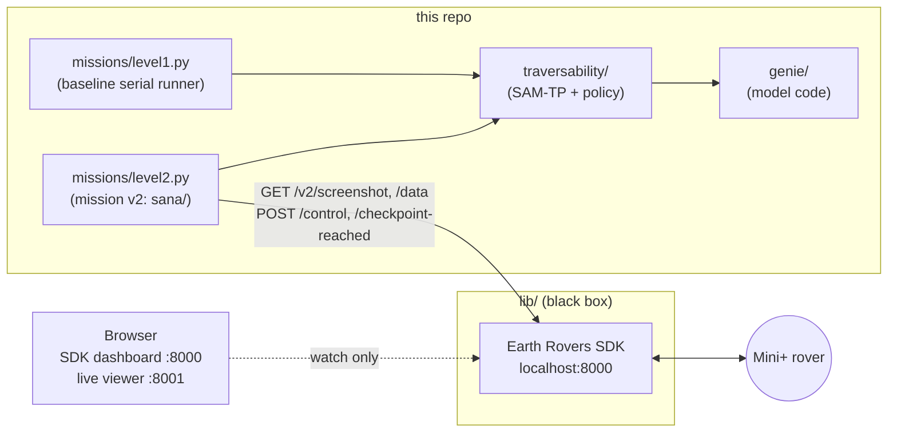

# Sana Rover Policy

Self-contained project for running GPS-checkpoint missions on a FrodoBots
Mini+ with traversability perception (SAM-TP fine-tuned on real Mini+
footage). Everything needed lives in this repo: the model code (`genie/`),
the perception + policy + mission package (`traversability/`), and the
mission runners (`missions/`, `sana/`). Weights auto-download from Hugging
Face on first use
([`sanatem/samtp-mini-traversability`](https://huggingface.co/sanatem/samtp-mini-traversability),
public, no token).

No ROS. The Earth Rovers SDK is used as a **black box** inside `lib/`: our
Python programs talk HTTP to `localhost:8000`, and the SDK's dashboard is
watched in a browser at the same URL.



## Layout

```
Sana_Rover_policy/
├── missions/level1.py    # baseline: serial perceive→decide→send loop (~2 Hz)
├── missions/level2.py    # mission v2: decoupled loops + field behaviors (below)
├── sana/                 # mission v2 package: pure FSM, threads, viewer, report
├── traversability/       # rover_traversability package (predictor, policy, tests)
├── genie/                # SAM2 fork with the SAM-TP prompt encoder (vendored)
├── scripts/setup.sh      # installs everything, clones the SDK into lib/
├── scripts/run_sdk.sh    # starts the SDK (black box) on localhost:8000
├── tests/                # mission v2 test suite (no torch, no network)
└── lib/                  # NOT versioned: the SDK, cloned by setup.sh
```

`lib/` is gitignored on purpose: update the SDK with `git pull` inside
`lib/earth-rovers-sdk` without touching this project; pin a version with
`git checkout <tag|commit>` there.

## Setup (once)

```bash
pyenv activate venv313   # project environment (see AGENTS.md)
./scripts/setup.sh
```

With an environment active, `setup.sh` installs into it; without one it
creates a local `.venv/` (Python 3.10–3.13). Then configure the bot
credentials in `lib/earth-rovers-sdk/.env`.

## Mission v2 (`missions/level2.py`) — the recommended runner

Rebuilt mission stack: a 5 Hz control loop decoupled from SAM-TP inference
(the model runs in its own thread at whatever rate the hardware gives),
driving a pure state machine with the behaviors that completed real missions
in the field:

- **Field-calibrated speeds** — the Mini+ firmware multiplies commands ~3-5x
  (cmd 0.25 ≈ 1.3 m/s physical) and has a ~0.15 command deadband; defaults are
  0.25 / 0.20. A GPS-measured **physical speed cap** (1.5 m/s) backs it up.
- **Align maneuvers with hysteresis** (enter >30°, exit <8°): arc-turn under
  45°, K-turn 45–135° (fwd/rev phases, wheels never counter-rotate), pivot
  beyond — with forward probes so the GPS heading stays alive, a locked turn
  direction across ±180° wrap, and stall escalation (boost, then a reverse
  momentum kick).
- **Stuck recovery**: wheels at ~0 RPM under a forward command → back up, turn
  (alternating sides), re-acquire heading; gives up after 3 events in 60 s.
- **GPS hygiene**: >500 m jumps rejected (with recovery after a real
  relocation), course-over-ground heading frozen during reverse motion,
  bearing EMA against magnetometer jitter.
- **Safety guards every tick**: battery floor, stale-mask stop (≤3 s), dead
  perception timeout, hard command clamps, throttled sends (changed commands
  go out immediately; unchanged ones ~1 Hz — the rover latches commands).

### Run it

```bash
# 1. No movement at all: full stack, viewer, logs — carry the rover around.
python missions/level2.py --dry-run

# 2. The real thing (flag is mandatory; without it nothing moves).
python missions/level2.py --start-mission --yes-i-want-the-rover-to-move --max-linear 0.2
```

While it runs, open **http://localhost:8001** — live SAM-TP overlay
(green = drivable) plus the current state, command, distance and latency.
Keep the SDK dashboard at :8000 **watch-only**: driving from it while the
policy runs means two writers fighting over /control.

Every run leaves `runs/<timestamp>/`:

- `decisions.jsonl` — one line per control tick (state, GPS, command, guards).
- `overlay_NNNNN.png` — what the model saw, every N frames.
- `result.json` — final summary.
- `report.html` — **self-contained report**: GPS trace colored by state,
  checkpoint markers, overlay filmstrip, stats (distance, achieved Hz,
  inference p95, stuck events). Regenerate any run with
  `python -m sana.report runs/<timestamp>`.

Useful flags (`--help` for all): `--max-linear`, `--max-seconds`,
`--arrive-attempt-m`, `--control-hz`, `--no-viewer`, `--renormalize`
(per-frame percentile stretch for soft-confidence scenes), `--checkpoint`.

### Field-test checklist

1. `--dry-run` with the rover on a stand: check the viewer, mask ages and
   decision stream while turning the rover by hand.
2. First powered run: `--yes-i-want-the-rover-to-move --max-linear 0.2
   --max-seconds 60`, spotter next to the rover. Verify the turn sign
   (angular positive = LEFT), the wiggle → align → pursue sequence, and that
   Ctrl-C stops the rover.
3. Full mission at default speed; review `report.html` and tune the
   `align_*` / `arrive_*` knobs in `sana/config.py` from data.

## Mission v1 (`missions/level1.py`) — baseline

The simple serial loop (perceive → decide → send, ~2 Hz): same SAM-TP model
and corridor policy through the vendored `MissionRunner`. Kept as the
reference implementation — it mirrors what the `rover-traversability` module
gives the UNLP team, and it is the natural side-by-side comparison for
showing what v2 adds.

```bash
python missions/level1.py --start-mission --yes-i-want-the-rover-to-move --max-linear 0.3
```

## Tests

```bash
python -m pytest tests/ -q                    # mission v2 suite (48 tests)
python -m pytest traversability/tests -q      # vendored package suite (67 tests)
```

Both run without torch, checkpoint or network.

## Safety

- The rover **latches the last command**: if the program dies mid-motion the
  rover keeps going. Both runners send stop in their `finally`; in the field
  keep the SDK dashboard open as the kill switch.
- On CPU-only machines inference takes ~0.5–4 s/frame; the runner detects it,
  widens the staleness budget and caps speed automatically (and the
  stale-mask guard stops the rover if perception stalls).

