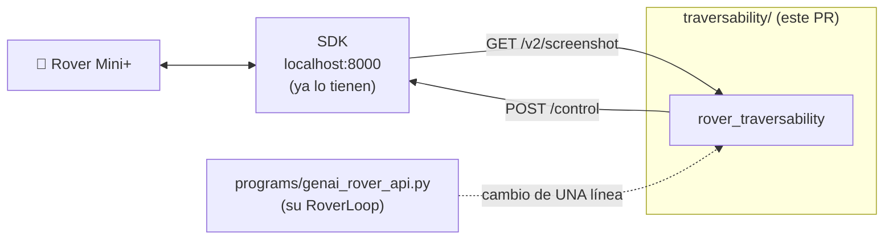
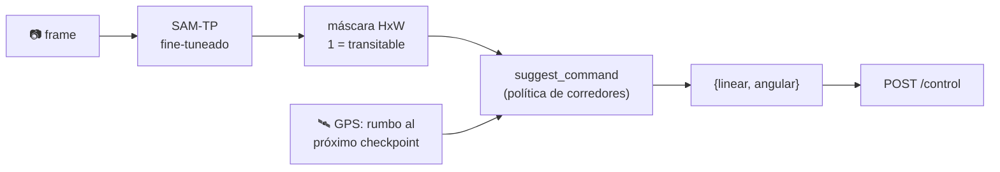
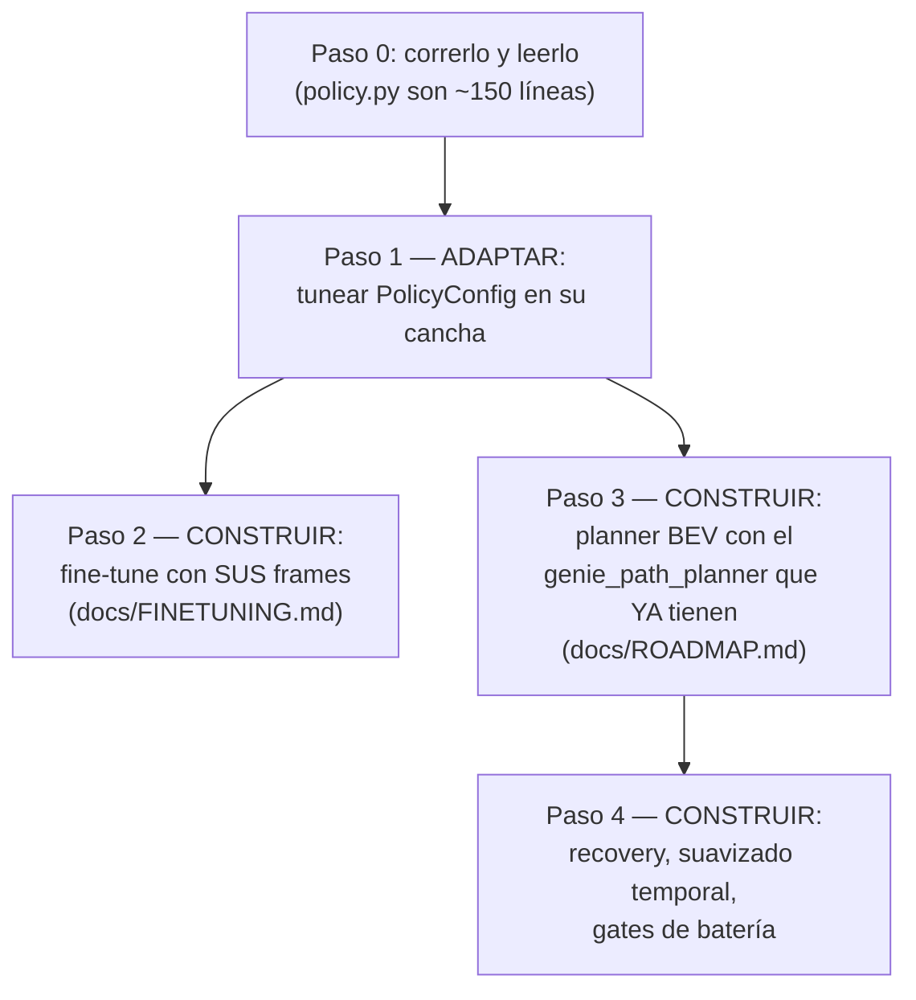

# rover-traversability — Guía rápida en español

**Qué es:** un módulo nuevo, 100% separado de su código, que le da al rover
*percepción aprendida*: mira un frame de la cámara y dice **por dónde se puede
manejar**, píxel por píxel. Usa el mismo modelo SAM-TP que ya tienen vendoreado
en `genie/`, pero **fine-tuneado con ~50.000 frames reales del Mini+** (eso ya
lo hicimos nosotros — entrenarlo necesita GPU y semanas de datos; ustedes lo
reciben listo).

## Dónde encaja en SU sistema



No toca ningún archivo de ustedes. Habla con el rover solo por HTTP.

## Qué hace por dentro



La máscara se ve así: verde = se puede manejar, rojo = no (prueben con
`screenshots/imagen.jpg` de este repo).

## Instalación (3 comandos, desde la raíz del repo)

```bash
pip install torch torchvision
pip install --no-build-isolation -e ./genie
pip install -e './traversability[hf]'
```

Los pesos del modelo (~130 MB) **se bajan solos** de Hugging Face la primera
vez ([`sanatem/samtp-mini-traversability`](https://huggingface.co/sanatem/samtp-mini-traversability), público, sin token).

## Probarlo en 4 niveles (de menos a más riesgo)

```bash
# 1. Una imagen, sin rover — genera overlay.png verde/rojo
python -m rover_traversability.demo predict screenshots/imagen.jpg --out overlay.png

# 2. Rover prendido pero NO manda comandos — solo guarda overlays en trav_out/
python -m rover_traversability.demo live --save-dir trav_out

# 3. Maneja esquivando obstáculos (¡espacio abierto, dedo en Ctrl-C!)
python -m rover_traversability.demo drive --yes-i-want-the-rover-to-move

# 4. Misión completa: va checkpoint por checkpoint usando GPS + percepción
python -m rover_traversability.demo mission --start-mission --yes-i-want-the-rover-to-move
```

O dentro de su propio loop, cambiando **una línea** de `programs/genai_rover_api.py`:

```python
from rover_traversability import TraversabilityStrategy

strategy = TraversabilityStrategy(drive=True)   # antes: Base64ImageStrategy()
loop = RoverLoop(strategy=strategy, sleep_seconds=0.5, max_iterations=None)
```

## Lo que construyen / adaptan USTEDES



**Adaptar la política** (todos los umbrales están en un solo lugar):

```python
from rover_traversability import PolicyConfig, TraversabilityStrategy

cfg = PolicyConfig(
    max_linear=0.35,            # más lento mientras prueban
    stop_center_fraction=0.5,   # frena menos seguido (default 0.4)
    k_angular=0.8,              # dobla más suave (default 1.2)
)
strategy = TraversabilityStrategy(policy=cfg, drive=True)
```

**Construir su propio logging** (para tunear con datos, no a ojo):

```python
def registrar(result, decision):
    print(decision.reason, decision.corridor_scores)  # guárdenlo en CSV

strategy = TraversabilityStrategy(on_decision=registrar, save_overlays_dir="debug/")
```

**Construir el planner BEV** (el salto grande — es SU proyecto): ya tienen el
planner (`genie_path_planner`, se instala con `./genie`) y este paquete trae la
calibración real de la cámara del Mini+ que faltaba:

```python
from rover_traversability import load_camera_K, load_T_base_camera
K = load_camera_K()              # intrínsecos reales (los del yaml de genie son de OTRO robot)
T = load_T_base_camera()         # pose de la cámara
# máscara -> proyectar al piso (BEV) -> plan_on_bev(...) -> pure pursuit -> /control
# Receta paso a paso: docs/ROADMAP.md, paso 3
```

**Construir su propio modelo** (fine-tune): junten frames donde el modelo se
equivoca → etiqueten transitable/no → entrenen arrancando desde nuestro
checkpoint → suban SU versión a HF y cambien una variable de entorno. Receta
completa: [docs/FINETUNING.md](docs/FINETUNING.md).

## Seguridad (leer antes de mover el rover)

- El rover **repite el último comando para siempre**: el silencio NO lo frena.
  Todo lo que decide "parar" acá manda activamente `{linear: 0, angular: 0}`.
- `drive` y `mission` se niegan a arrancar sin `--yes-i-want-the-rover-to-move`.
- Primera prueba de campo: espacio abierto, y verifiquen que doble para el lado
  correcto (convención: `angular` positivo = izquierda).

## Tests (sin modelo, sin torch, sin red)

```bash
pip install -e './traversability[dev]'
pytest traversability/tests     # 67 tests
```

---

📖 Referencia completa en inglés: [README.md](README.md) ·
Hoja de ruta: [docs/ROADMAP.md](docs/ROADMAP.md) ·
Fine-tuning: [docs/FINETUNING.md](docs/FINETUNING.md)
